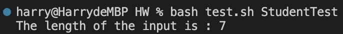

# Lab Report 5

## Student Post

Hi, I want to ask a question about this week's homework. I have finished it, but when I ran the `test.sh`, I found the output result was wrong: it didn't correctly print the length of my input `StudentTest`, the length should be 11. Can you help me check if I made any mistakes in my code? Thanks! Below is my code and screenshot of the incorrect output.

```
class numCount {
    public static void main(String[] args) {
        String input = args[0];
        System.out.println("The length of the input is : " + input.length());
    }
}
```



## TA response

Hi, I am Yuxiang Hong, the TA for this course. After checking your code, I don't think there is any error in the code. Did you notice that the incorrect output is actually the length of `test.sh`? Based on this, I recommend checking your code in the `test.sh` file to see if the program gets the expected argument as input. I guess, maybe you're using `$0` instead of `$1` to refer to the first argument? This issue is common for students who first learn about how to write a shell script. If you have any other questions, please let me know.

## Student response

Thanks for the reply! I found that I indeed had such an issue in my script.
Here is my original shell script:

```
javac *.java
java numCount $0
```

I realized that I mistakenly used $0 instead of $1 to refer to the first argument. So, when I ran `bash test.sh StudentTest` in the terminal, the program took `test.sh` as the input argument and printed the length of it rather than the length of my expected input argument (`StudentTest`). Right now, I have fixed it by changing `$0` to `$1` in `test.sh`. Thanks again for your help!

## Setup information

Directory Structure:

```
HW
    numCount.java
    test.sh
```

Files Before Fixing the Bug:

`numCount.java`:

```
class numCount {
    public static void main(String[] args) {
        String input = args[0];
        System.out.println("The length of the input is : " + input.length());
    }
}
```

`test.sh`:

```
javac *.java
java numCount $0
```

The Full Command Line I Ran to Trigger the Bug:

`bash test.sh StudentTest`

Description of Bug Fixing:

I changed `$0` in `test.sh`, which refers to the wrong argument, to `$1`, which refers to the expected input argument.
